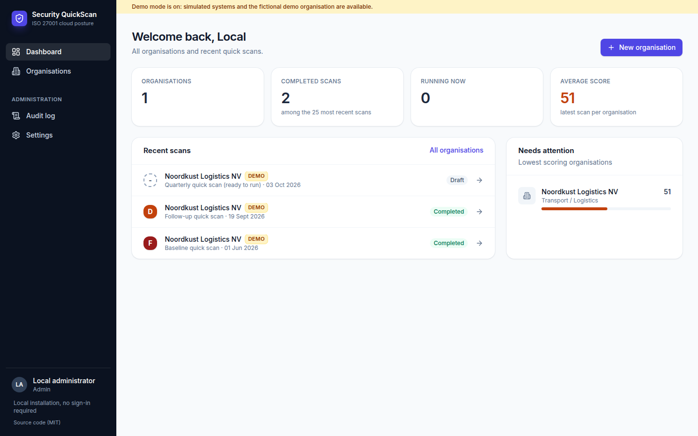
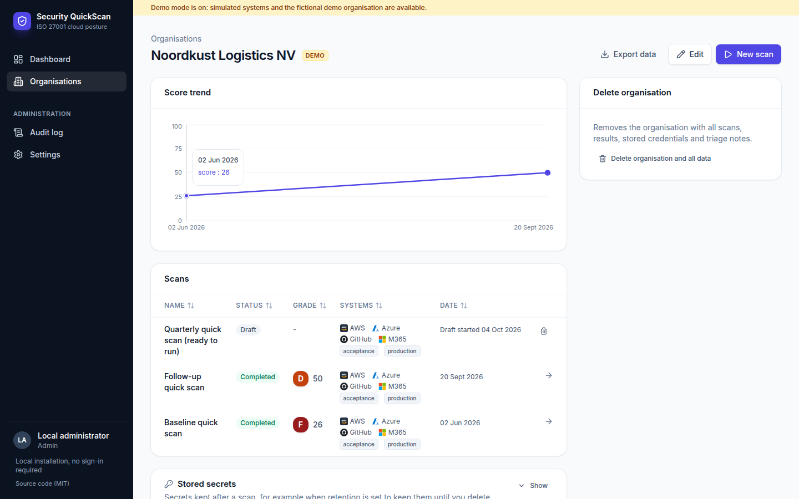
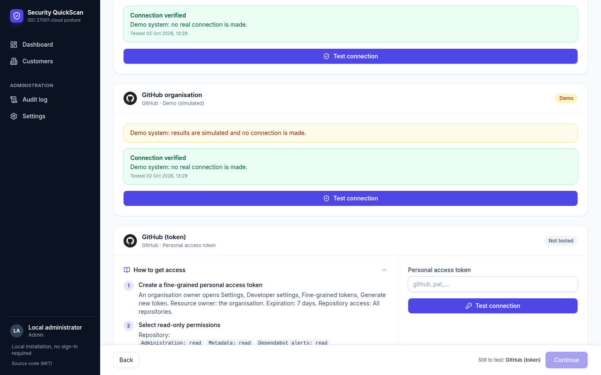
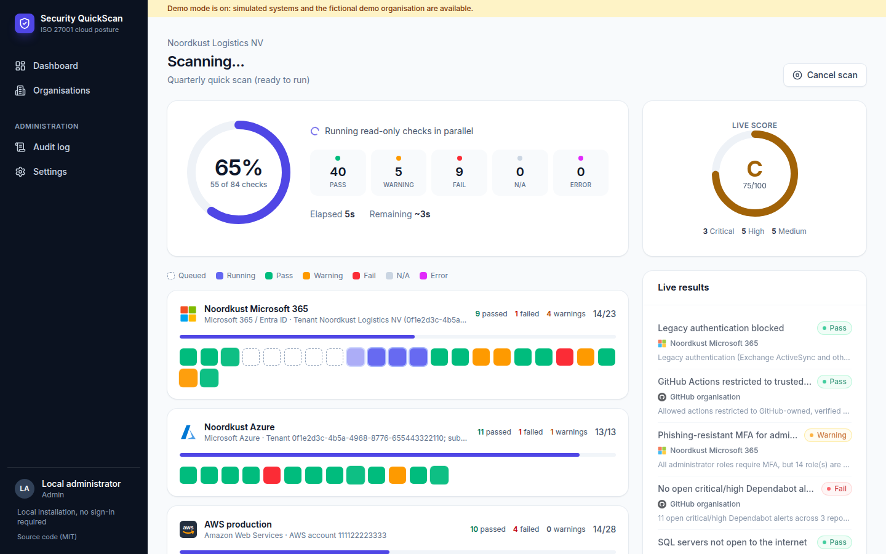
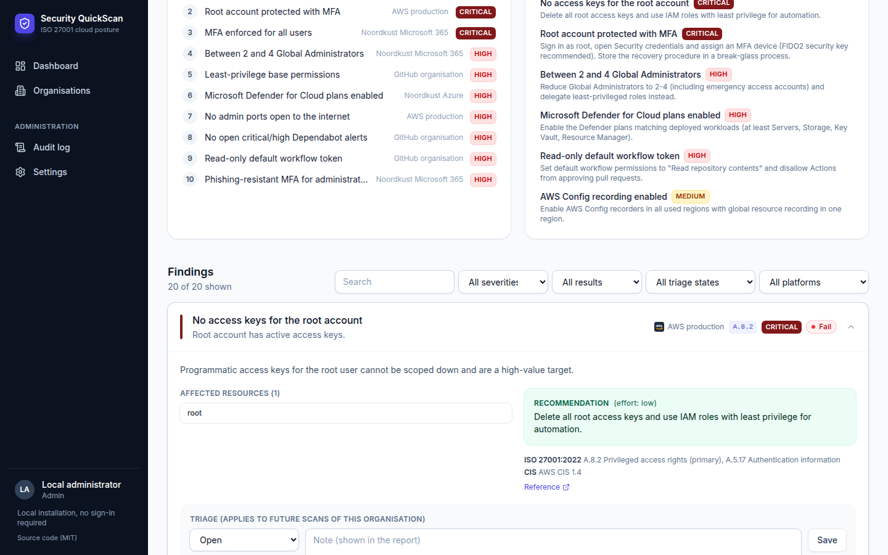
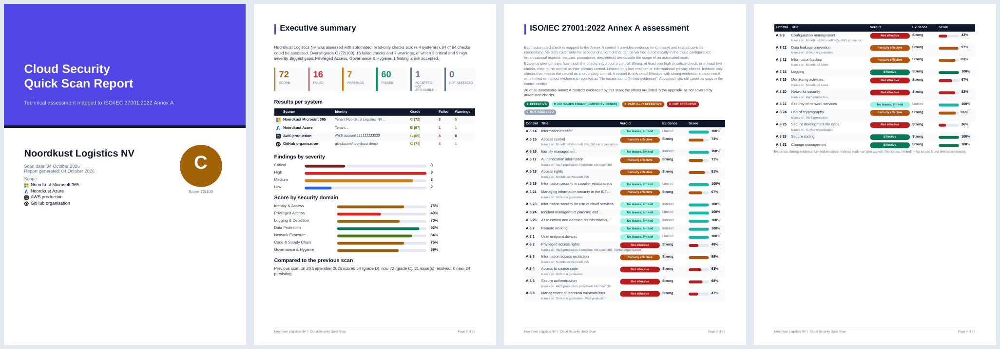
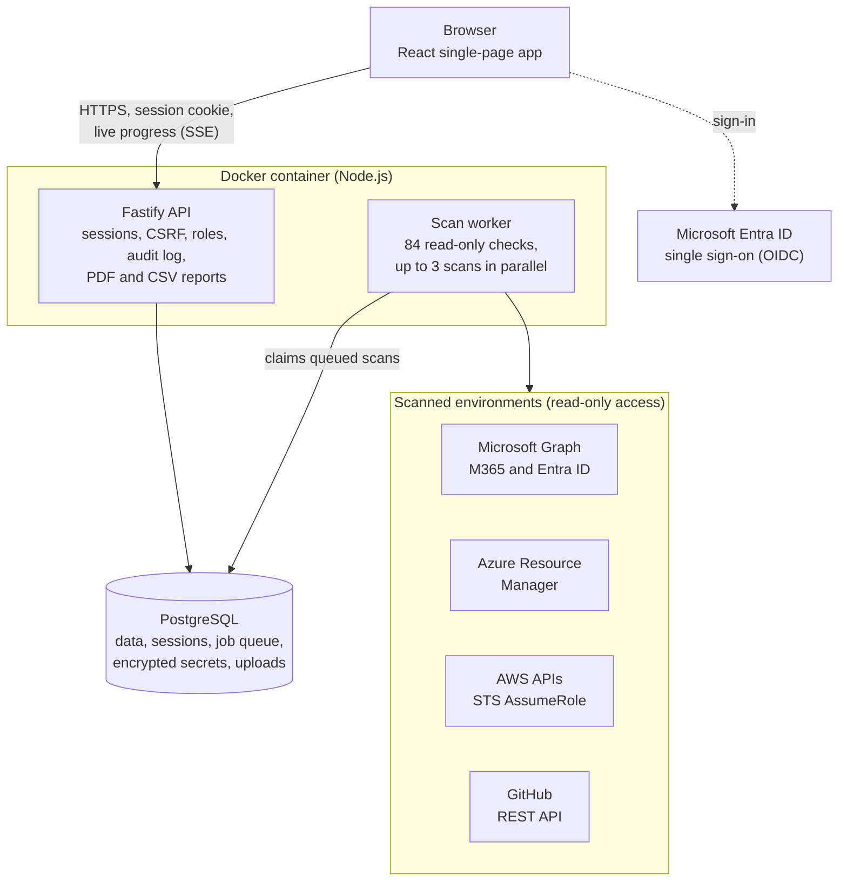

# Security QuickScan

**Read-only security quick scans of Microsoft 365 / Entra ID, Azure, AWS and GitHub, evaluated against ISO/IEC 27001:2022 Annex A, with shareable reports.**

[](https://github.com/yopazerbot/security-quickscan/actions/workflows/docker.yml)
[](LICENSE)

Security QuickScan is a self-hostable web application for internal IT and security teams, MSPs and consultants, and auditors who need a fast, repeatable and well-documented view of an organisation's cloud security posture. It is a pure best-practice and compliance scan, not a risk assessment, and asks for as little input as possible: name the organisation, choose the systems in scope, connect with read-only access, watch every check run live, and share a branded PDF.

Run it on your laptop with one Docker command (no login, nothing leaves your machine), or host it for a team with Microsoft Entra ID single sign-on.

**[Watch the 15-second product video](docs/video/quickscan-product-video.mp4)** (MP4, 1080p). The video is generated from code; see [docs/video/source](docs/video/source).

## Highlights

- **84 automated, read-only checks** across Microsoft 365 / Entra ID (23), Azure (13), AWS (28) and GitHub (20). See the [check catalogue](docs/CHECKS.md).
- **ISO/IEC 27001:2022 Annex A as the backbone.** Every check maps to a primary Annex A control, and results roll up into a per-control verdict (effective, no issues found with limited evidence, partially effective, not effective or not assessed) with an evidence strength, and every finding links back to the system and console page it came from. CIS and NIS2 references are included as secondary mappings.
- **Best practice, not risk based.** An organisation is just a name. Every scan runs every check for the platforms in scope, with no questionnaire, criteria selection or weighting; findings that do not apply are marked not applicable afterwards.
- **Guided, least-privilege access.** Step-by-step instructions per platform, including a ready-made AWS CloudFormation role with external ID and a Microsoft admin-consent flow, so no long-lived secrets need to be shared. A connection test checks access before scanning.
- **You choose how long credentials are kept** per scan: deleted right after the scan, kept for N days, or kept until you delete them. Secrets are always envelope-encrypted (AES-256-GCM) and never shown again.
- **Live scan progress** with per-system lanes, a live score and an ETA.
- **Reports that are ready to share:**
  - an interactive web report: grade and trend, Annex A heatmap, domain radar, top risks, quick wins, filterable findings with evidence and remediation;
  - a branded [PDF report](docs/sample-report.pdf);
  - CSV exports of findings and of the Annex A control assessment.
- **Triage that sticks.** Mark a finding on a specific system as risk accepted or as not applicable / false positive with a note; the decision carries over to later scans of that system and is reflected in their score. Finished reports never change afterwards.
- **Private by default** (hosted mode): each user sees only the organisations they own; the owner shares an organisation with specific colleagues as view or edit, on a need-to-know basis. Admin, analyst and viewer roles and an append-only audit log.
- **Demo mode** with a realistic fictional organisation, for trying the tool or giving others a tour, plus an optional PIN login for demo visitors.

## Screenshots

| | |
| --- | --- |
|  **Dashboard** |  **Organisation history and trend** |
|  **Guided, read-only access** |  **Live scan progress** |
|  **Findings with evidence and remediation** |  **Branded PDF report** |

All screenshots show the built-in fictional demo organisation.

## Quick start: run it locally with Docker

Requirements: Docker with Compose.

```bash
git clone https://github.com/yopazerbot/security-quickscan.git
cd security-quickscan
docker compose up -d --build
```

Then open the one-time sign-in link the container prints:

```bash
docker compose logs app | grep -A1 "Open this link"
```

The link looks like `http://localhost:8080/?local_token=...`. Opening it once signs your browser in (like Jupyter); after that, plain `http://localhost:8080` works. No account or configuration is needed, and the link changes every time the container restarts.

To explore with the fictional demo organisation and simulated systems:

```bash
DEMO_MODE=true docker compose up -d --build
```

Useful commands:

| What | Command |
| --- | --- |
| Use another port | `PORT=9000 docker compose up -d` |
| Stop (keep data) | `docker compose down` |
| Stop and delete all data | `docker compose down -v` |
| Update to the latest version | `git pull && docker compose up -d --build` |

Once the image is published to the GitHub Container Registry you can skip `--build`; Compose then pulls `ghcr.io/yopazerbot/security-quickscan:latest`.

### How local mode stays safe without a login

`docker-compose.yml` runs the app with `LOCAL_MODE=true`:

- The port is published on **127.0.0.1 only**, so other machines on your network cannot reach it. If you change that, keep it on 127.0.0.1: the app warns at startup when local mode listens on all interfaces.
- Inside the container, a session can only be started with the one-time link printed at startup, so even a wrongly published port does not hand out access.
- The app answers only requests addressed to `localhost`, `127.0.0.1` or `[::1]` (this also blocks DNS-rebinding attacks), and it refuses to start in local mode with a non-localhost `APP_URL`.
- CSRF protection and same-origin checks stay active.
- The encryption key for stored credentials is generated on first start and kept in the `appdata` Docker volume (`/data/master.key`, readable only by the app). Back up that volume if you keep secrets between scans.
- The container runs as a non-root user with a read-only filesystem and all Linux capabilities dropped. The database is not exposed outside the Compose network.

Do not expose local mode to a network. To share the tool with colleagues or a wider team, use the hosted setup below.

## How a scan works

Create the organisation once: it only needs a name. Then a scan takes three steps:

1. **Scope.** Add the environments to assess: Microsoft 365 tenants, Azure tenants, AWS accounts and GitHub organisations, as many of each as needed.
2. **Access.** Follow the per-platform guidance, store the read-only credentials (or use a secret-less method) and run a connection test. Choose how long secrets are kept.
3. **Review and start.** Check that every system is connected, see how many checks will run and how secrets are retained, then start the scan. Watch it run live, then open the report.

Every check for the platforms in scope runs; there is no criteria step. When a finding does not apply to the organisation, mark it as **Not applicable / false positive** in the report's triage: it is left out of the score of every scan of that system that finishes from then on.

Rescan later with one click: scope and still-valid credentials are copied, and the report shows what was resolved, what is new and what persists.

## What it checks

| Platform | Checks | Examples |
| --- | --- | --- |
| Microsoft 365 / Entra ID | 23 | Conditional Access coverage including exclusions and break-glass accounts, legacy authentication and device code flow, phishing-resistant MFA for all privileged roles, admin session controls, number matching, Global Administrator count including PIM-eligible members, PIM, privileged guests, user consent, risky app permissions and long-lived app credentials, stale accounts, SPF/DKIM/DMARC, Secure Score |
| Microsoft Azure | 13 | Defender for Cloud plans and high-severity recommendations, storage public access, network rules, shared keys, TLS 1.2 and HTTPS, Key Vault soft delete, purge protection and RBAC, NSG management ports, SQL firewall, auditing and TDE, activity log categories, backup vault soft delete and immutability, subscription owners |
| Amazon Web Services | 28 | Root MFA, keys and recent use, administrators through users, groups, roles and inline policies, IAM user MFA, key rotation and unused credentials, CloudTrail event selectors, GuardDuty, Security Hub standards and failed controls, Inspector, Config, S3 public access through policies and ACLs, TLS-only buckets, public snapshots and AMIs, security groups and default security groups, VPC flow logs, IMDSv2, RDS exposure, encryption and backups, AWS Backup plans, KMS rotation |
| GitHub | 20 | Organisation 2FA and members without 2FA, base permissions, owners, outside collaborators with write or admin, branch protection and ruleset content, secret scanning, push protection and open secret alerts, Dependabot alerts and security updates, recent code scanning, Actions policies and token permissions, GitHub App installations, security defaults for new repositories, deploy keys, webhooks |

The full list with severities, Annex A mappings, CIS and NIS2 references is in [docs/CHECKS.md](docs/CHECKS.md).

## The ISO 27001 approach

Each check names one **primary** Annex A control and optionally **secondary** controls. Per control, the verdict is:

| Verdict | Rule |
| --- | --- |
| Effective | all evaluated checks for the control pass and the evidence is strong |
| No issues found (limited evidence) | all evaluated checks pass, but the evidence is limited or indirect |
| Not effective | a primary check of critical or high severity fails, or less than 50% of the weighted evidence passes |
| Partially effective | anything in between, including a critical or high failure on a secondary mapping |
| Not assessed | only not-applicable or errored checks |

Evidence strength per control:

| Evidence | Meaning |
| --- | --- |
| Strong | at least one primary check of high or critical severity, or at least two primary checks, was assessed |
| Limited | only primary checks of lower severity were assessed |
| Indirect | the control is only evidenced through secondary mappings |

An accepted risk still counts as a gap for the control (half credit): accepting a risk does not make a control effective. Assessable Annex A controls that no check evidenced are listed as **not covered** in the report, the PDF and the CSV, so coverage gaps are visible rather than silent. Each control lists the results that fed it per system.

The overall score (0 to 100, graded A to F) weights each check by its severity only; every domain counts the same. Findings marked as not applicable / false positive are left out of the score, and so are accepted risks, but both stay listed in the report.

The report states clearly that verdicts reflect **technical evidence only**: organisational aspects of a control (policies, processes, awareness) are outside what an automated scan can see.

## Access methods and required permissions

All access is read-only. The wizard shows these steps in context, with copy buttons.

| Platform | Recommended method | Alternative |
| --- | --- | --- |
| AWS | Cross-account IAM role with a least-privilege inline policy (only the 46 read actions the checks use, no access to data such as S3 objects), assumable only by your scanner identity with a per-scan external ID. The app generates the CloudFormation template ([infra/aws-scanner-role.yaml](infra/aws-scanner-role.yaml)). `iam:GenerateCredentialReport` is the only non-Get/List/Describe action: it refreshes IAM's own credential report and changes no configuration. | Temporary or dedicated read-only access keys with the same policy |
| Microsoft 365 / Entra ID | Admin consent to your multi-tenant read-only scanner app. Graph application permissions: `Directory.Read.All`, `Policy.Read.All`, `RoleManagement.Read.Directory`, `AuditLog.Read.All`, `Application.Read.All`, `Reports.Read.All`, `SecurityEvents.Read.All` | App registration created in the tenant, with a short-lived client secret |
| Azure | Same app, plus `Reader` and `Security Reader` on the subscriptions in scope | App registration created in the tenant |
| GitHub | Fine-grained personal access token with read-only permissions, created by an organisation owner | Classic token |

Some Microsoft checks need Entra ID P1/P2 licences; without them they are reported as not applicable rather than failed.

**Upgrading from an earlier version:** the AWS role now needs 46 read actions (previously 24), for checks such as administrators through groups and roles, S3 ACLs, public snapshots, VPC flow logs, AWS Backup and Inspector. Update the CloudFormation stack with the template from the wizard. Until then, the checks that need the new actions report "could not be evaluated" rather than failing.

## Hosted setup (team use with Microsoft sign-in)

The same Docker image runs as a hosted service. It needs only a Postgres database: no Redis, no object storage. PDFs and CSVs are generated on demand.

### 1. Microsoft Entra app for signing in

In your own tenant: **App registrations > New registration**.

1. Name it, for example `Security QuickScan`, with supported accounts **Accounts in this organizational directory only**.
2. Under **Authentication**, add the **Web** platform with redirect URI `https://<your-domain>/api/auth/callback`. Leave implicit grant unchecked and keep **Allow public client flows** set to **No**.
3. Under **Certificates & secrets**, create a client secret and copy its **Value**.
4. Recommended: in **Enterprise applications**, set **Assignment required** to **Yes** and assign the people who may use the tool. Protect the app with a Conditional Access policy that requires (phishing-resistant) MFA.

Users are invite-only: an administrator adds them under **Users**. The first administrator is created by signing in once with the address in `BOOTSTRAP_ADMIN_EMAIL`; remove that variable afterwards.

### 2. Optional: scanner identities for secret-less access

- **Microsoft:** register a second app, **multitenant**, with Web redirect URI `https://<your-domain>/consent/callback` and the Graph application permissions listed above. Create a client secret and set `SCANNER_MS_CLIENT_ID` and `SCANNER_MS_CLIENT_SECRET`. A tenant administrator then grants consent via a link from the wizard.
- **AWS:** create an IAM user in your own account with only [infra/scanner-platform-policy.json](infra/scanner-platform-policy.json) attached (it may only assume `SecurityQuickScanReadOnly` roles). Set `SCANNER_AWS_ACCESS_KEY_ID` and `SCANNER_AWS_SECRET_ACCESS_KEY`.

### 3. Deploy

Any Docker host works. Example for [Railway](https://railway.com):

1. Create a project and add **PostgreSQL**.
2. Add **one** service from this repository. It builds the `Dockerfile` using `railway.json`: start command, health check on `/healthz`. If Railway offers to create one service per package of this monorepo, keep a single service with the repository root as root directory.
3. Set the variables (below), generate a domain, and update the redirect URIs in Entra.

Migrations run automatically on start. Enable database backups.

### Configuration

| Variable | Required | Description |
| --- | --- | --- |
| `DATABASE_URL` | yes | Postgres connection string (on Railway: `${{Postgres.DATABASE_URL}}`) |
| `APP_URL` | yes (hosted) | Public URL without trailing slash, e.g. `https://scan.example.com` |
| `MASTER_KEY` | yes (hosted) | 32 random bytes, base64 (`openssl rand -base64 32`). Encrypts stored credentials. |
| `MASTER_KEY_PREVIOUS` | no | Previous master key during a key rotation (see below) |
| `ENTRA_TENANT_ID`, `ENTRA_CLIENT_ID`, `ENTRA_CLIENT_SECRET` | yes (hosted) | Sign-in app from step 1 |
| `BOOTSTRAP_ADMIN_EMAIL` | first start | This account becomes administrator on its first sign-in |
| `ENTRA_REQUIRE_MFA` | no | Reject tokens without an MFA claim |
| `BREAKGLASS_ENABLED`, `BREAKGLASS_USERNAME`, `BREAKGLASS_PASSWORD_HASH`, `BREAKGLASS_TOTP_SECRET` | no | Emergency login when Entra is unavailable: password (Argon2id) plus TOTP, rate limited, audited |
| `SCANNER_MS_CLIENT_ID`, `SCANNER_MS_CLIENT_SECRET` | no | Multi-tenant scanner app (admin consent method) |
| `SCANNER_AWS_ACCESS_KEY_ID`, `SCANNER_AWS_SECRET_ACCESS_KEY` | no | Identity that assumes the scanner roles in the AWS accounts to assess |
| `LOCAL_MODE` | no | Single-user local installation without login (see above) |
| `DEMO_MODE` | no | Fictional demo organisation and simulated systems |
| `MODE` | no | `all` (default), or run `api` and `worker` as separate services |
| `SESSION_IDLE_MINUTES`, `SESSION_MAX_HOURS` | no | Session timeouts (default 30 minutes idle, 8 hours absolute); users get a warning two minutes before expiry |
| `AUDIT_RETENTION_MONTHS` | no | How long audit log entries are kept (default 24) |
| `TRUST_PROXY` | no | Proxy hops in front of the app, used for client IPs in rate limits and the audit log. Defaults to `1` on Railway and `false` elsewhere; set it to match your reverse proxy |
| `DATABASE_SSL`, `COOKIE_SECURE`, `PORT`, `LOG_LEVEL` | no | Infrastructure settings, see [.env.example](.env.example) |

Generate break-glass values with the bundled CLI:

```bash
npm ci && npm run build -w @qs/server
node apps/server/dist/cli.js hash-password    # BREAKGLASS_PASSWORD_HASH
node apps/server/dist/cli.js gen-totp         # BREAKGLASS_TOTP_SECRET (add the URI to an authenticator app)
node apps/server/dist/cli.js gen-master-key   # MASTER_KEY
```

Rotate the master key without downtime:

1. Set `MASTER_KEY_PREVIOUS` to the current key and `MASTER_KEY` to a new one, and deploy. The app now encrypts with the new key and can still read data encrypted with the old one, so connection tests and running scans keep working.
2. While the app is running, run `node apps/server/dist/cli.js rotate-master-key` against the same database to re-encrypt stored credentials with the new key.
3. Remove `MASTER_KEY_PREVIOUS` and deploy again.

## Security model

- **Authentication (hosted):** Microsoft Entra ID OpenID Connect with authorization code, PKCE, state and nonce, single tenant, tenant ID validated. Tokens stay on the server; the browser only holds a random session cookie (`HttpOnly`, `Secure`, `SameSite=Strict`, `__Host-` prefix) whose hash is stored in Postgres. Sessions expire after 30 minutes idle and 8 hours absolute, and rotate at login.
- **Access control (need-to-know):** invite-only users with roles admin, analyst and viewer. Every organisation has an owner, who decides who else may view or edit it (when an admin deletes, deactivates or demotes an owner, they must pick a new owner in the same step); other users get 404, not 403, so they cannot even tell it exists. Shares go to existing accounts by email (no user directory is exposed), viewer accounts always stay read-only, and admins can see and manage all organisations. Access is checked on every request and re-checked on live progress streams.
- **CSRF:** SameSite=Strict cookies, a per-session CSRF token header, and Origin / `Sec-Fetch-Site` checks on every state-changing request.
- **Stored credentials:** envelope encryption: a fresh AES-256-GCM data key per secret, wrapped by the master key, with authenticated data binding each ciphertext to its scan and system. Secrets are write-only in the API, decrypted only in memory during a connection test or scan, and purged according to the retention you choose.
- **Least privilege:** read-only permissions only. The preferred methods (AWS role with external ID, Microsoft admin consent) avoid exchanging secrets at all.
- **Hardening:**
  - strict Content Security Policy (no inline scripts), HSTS, `frame-ancestors 'none'`, no-referrer, Permissions-Policy;
  - rate limiting, request size limits, and input validation with zod on every endpoint;
  - parameterised SQL;
  - HTTP calls to the Microsoft and GitHub APIs are restricted to allow-listed hosts with redirects disabled, and no user-supplied URLs are ever fetched;
  - secrets, cookies and OAuth codes redacted from logs;
  - CSV formula-injection protection and PNG/JPEG-only logo upload.
- **Microsoft tenant links:** a Microsoft tenant can be linked to only one organisation, and only after Microsoft confirms that the admin consent was granted through that organisation's consent link. Links survive deletion of the organisation until an admin releases them under Settings.
- **Audit:** an append-only audit log of logins, break-glass and demo access, sharing and ownership changes, credential storage, use and purge, scans, report views and exports, and admin changes. A database trigger blocks updates and deletes; the only way to remove entries is the retention job (`AUDIT_RETENTION_MONTHS`).
- **Supply chain:** lockfile, Dependabot, and CI with typecheck, unit and integration tests, end-to-end tests, `npm audit` and gitleaks, plus CodeQL code scanning.

Found a vulnerability? Please follow [SECURITY.md](SECURITY.md).

## Demo mode

With `DEMO_MODE=true` the app adds simulated systems to the wizard and, on startup, seeds the fictional organisation **Noordkust Logistics NV**. It uses only reserved example domains and documentation account IDs. The seed contains:
- two completed scans with an improving trend;
- triaged findings;
- a draft scan ready to run.

Simulated findings are realistic for each check, for example a public invoices bucket, RDP open to the internet, or an MFA policy left in report-only mode. Administrators can reset the demo data under **Settings > Demo data**.

For hosted demos, an administrator can enable a **demo PIN login** in the same place:
- The PIN is 8 to 12 digits and stored as an Argon2 hash.
- Visitors who enter it only see demo organisations. They can only add simulated systems, cannot store credentials and cannot open administration pages.
- Attempts are rate limited and locked for 15 minutes after 5 failures.
- Changing the PIN or turning it off ends all demo sessions.

## Architecture



Code layout:

```
apps/web         React 19 single-page app (Vite, Tailwind CSS, TanStack Query, Recharts)
apps/server      Fastify API and scan worker, Drizzle ORM (Postgres), PDFKit reports
packages/shared  Types, ISO 27001 catalogue, check catalogue, scoring
packages/checks  Check implementations: AWS SDK v3, Microsoft Graph, Azure Resource Manager, GitHub REST
e2e              Playwright end-to-end tests
infra            AWS CloudFormation role and scanner policy
```

- One Docker image. By default the API, the built web app and the scan worker run in one process; set `MODE=api` and `MODE=worker` to split them.
- Postgres is the only state: application data, sessions, the job queue (`FOR UPDATE SKIP LOCKED`), encrypted secrets and uploads.
- Each stored secret is encrypted (AES-256-GCM) with its own key, which is wrapped by the master key from `MASTER_KEY` (or a generated key file in local mode). The database alone cannot decrypt anything.
- Scan progress streams to the browser with Server-Sent Events.

## Development

Requirements: Node.js 22 and a Postgres database.

```bash
npm install
cp .env.example .env    # set DATABASE_URL and LOCAL_MODE=true (no login) for the quickest start
npm run dev             # API on :8080, Vite dev server on :5173 (proxies /api)
```

Tests:

```bash
npm run typecheck
npm test                                                      # unit tests
TEST_DATABASE_URL=postgres://localhost/quickscan_test npm test   # plus API, seeding and local-mode tests
DATABASE_URL=postgres://localhost/quickscan_e2e scripts/e2e-local.sh   # Playwright end-to-end suite (empty database)
```

The end-to-end suite starts the app in demo mode and covers:
- the seeded organisation and its reports;
- running a scan to completion;
- PDF and CSV downloads, and triage;
- a new organisation through the full wizard;
- demo reset, demo PIN login and sign out.

### Adding a check

1. Add its metadata to `packages/shared/src/catalog/<platform>.ts`: severity, domain, effort, remediation, references and ISO 27001 controls (primary first).
2. Implement it in `packages/checks/src/...`, returning `pass`, `fail`, `warn`, `na` or `error` with the affected resources.
3. Add a demo scenario in `packages/checks/src/demo.ts`.
4. Run `npm test` (it verifies that every check maps to known Annex A controls and has an implementation and a demo scenario) and `npm run docs:checks`.

## Limitations

- This is a point-in-time, automated configuration review. It is not a penetration test, and it does not cover on-premises systems, endpoints or organisational controls.
- Results depend on the permissions and licences available to the scanning identity. Checks that cannot see everything (denied resources, skipped regions or subscriptions, truncated lists) report a warning that says what was not evaluated, and checks that see nothing report an error; they never silently pass. A scan where fewer than half of the checks could be assessed gets no grade, and a scan with less than 90% coverage is marked Partial.
- Repository-level GitHub checks look at the 200 most recently pushed repositories.

## Upgrading

- **From versions before need-to-know sharing:** the former "access to all organisations" option no longer exists. Users who relied on it only see organisations they own or that are shared with them. To find them, look in the audit log for `user.update` or `user.create` entries with `allCustomers: true`, then share the relevant organisations with them.
- **Triage** decisions made before per-system triage keep applying to every system of the organisation. New decisions apply to one system.
- Database migrations run automatically at startup.

## Contributing

Issues and pull requests are welcome. See [CONTRIBUTING.md](CONTRIBUTING.md). New checks with a clear Annex A mapping and a demo scenario are especially appreciated.

## Responsible use

Only scan environments you are authorised to assess; obtaining that permission is your responsibility. The software is provided without warranty (see the license).

Microsoft, Entra, Azure, AWS and GitHub are trademarks of their respective owners. This project is not affiliated with or endorsed by them. ISO/IEC 27001 control titles are paraphrased for reference.

## License and credit

[MIT](LICENSE), Copyright (c) 2026 Yoshi Parlevliet.

You are free to use, modify, self-host and redistribute Security QuickScan, including commercially, **as long as you credit the author**: keep the copyright and license notice in all copies or substantial portions of the software, and please keep the "Developed by Yoshi Parlevliet" credit visible in the app.

Developed by Yoshi Parlevliet.
